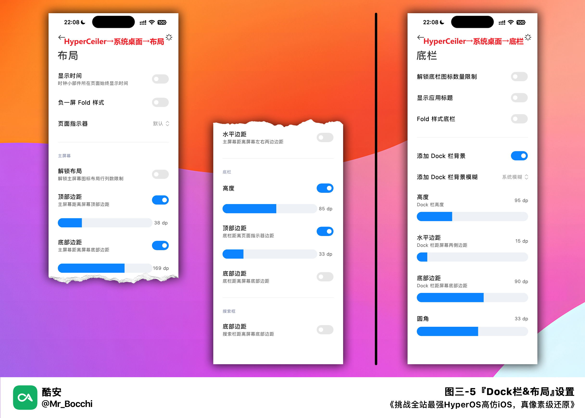
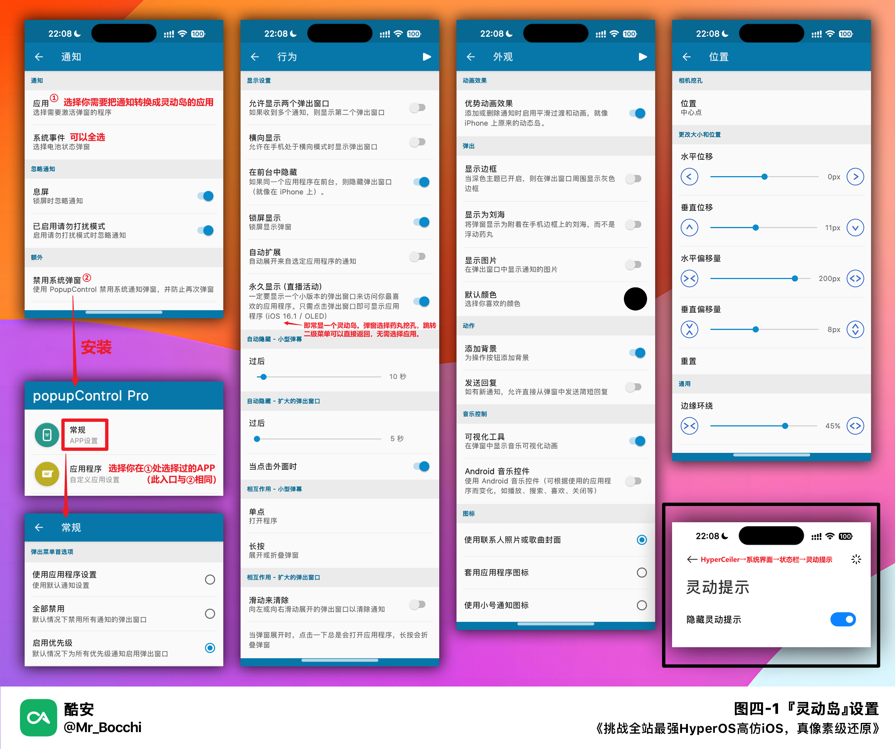

<h1 align="center">《挑战全站最强HyperOS高仿iOS，真像素级还原》</h1>

<p align="center">
  
</p>

# 前言

> [!IMPORTANT]
>  本图文测试、对比、制作总耗时两个月，选取汇总了我认为目前模仿最像的高仿模块，为一期高质量更新。
>
> 再次说明，本图文仅追求在使用较少的模块下，实现效果尽可能好的高仿。为实现高仿效果，有些地方还可能会做一些不适合日用的美化，请自行取舍。

```
• 测试机型：Xiaomi 12X
• 分辨率：2400 x 1080
• 系统版本：OS 1.0.3.0.UMACNXM By S.Team ColdCat | Android 14
• ROOT管理器：Kitsune Mask_26.4-kitsune-2
• 主题壁纸版本：4.2.2.6（官方）
```

> [!NOTE]
> 说明：以下设置的具体参数都是基于以上环境，具体请按实际情况进行调整。

> [!TIP]
> 所有文件在文末链接中都有，图文中链接只是引用来源。
>
> 模块中所有未提及或未截图部分的设置，在本图文中全部保持默认。

# 🌸🌸🌸教程立即发车🌸🌸🌸

## 🔴 目录&预览
### ⭕ 目录

* [一、主题](#🔴-一主题)
* [二、锁屏](#🔴-二锁屏)
* [三、桌面](#🔴-三桌面)
* [四、状态栏](#🔴-四状态栏)
* [五、通知中心](#🔴-五通知中心)
* [六、控制中心](#🔴-六控制中心)
* [七、其他](#🔴-七其他)
* [八、进阶](#🔴-八进阶)

### ⭕ 预览 
- 我会按照目录中的顺序由外而内逐一介绍。
- 📱成品演示

  

## 🔴 一、主题

### ⭕ 1. 主题破解
- 版本：1.8.0-for 0.07
- 来源：原开发者已停更，来源于“主题破解”分区

### ⭕ 2. 主题
- 主题：`学长iOS17 HyperOS（官方系统组件版本）`
- 来源：https://www.coolapk.com/feed/51457930
- 备注：尊重原作者，请在原作者后台获取。我使用的版本号及校验值见分享文件。后简称 `《学长iOS17》` 。

### ⭕ 3. 字体
- 字体：学长iOS16 苹方
- 备注：`《学长iOS17》` 主题内置

### ⭕ 4. 核心破解
- 软件：`HyperCeiler`（后省略版本和来源）
- 版本：2.3.135_20231231(135)_beta
- 来源：官方 Beta Test 频道
- 设置：`⚙️系统框架→包管理服务：[前五项全开]`

## 🔴 二、锁屏

- 主题：`《学长iOS17》`
- 壁纸：我的壁纸文件已分享在文末链接内。
- 备注：由于HyperOS在第三方主题下直接应用锁屏壁纸时依旧会出问题，所以需要先将壁纸导入主题mtz文件，替换掉原有的锁屏壁纸，再应用修改后的主题。
- 设置：

  

- 设置 [可选]：
`⚙️系统设置→通知与状态栏→状态栏-锁屏时可下拉操作→控制中心：[开启]`

## 🔴 三、桌面

### ⭕ 1. 壁纸
- 壁纸：已在 `二、锁屏` 中导入mtz文件。

### ⭕ 2. 图标

#### ① 基础图标
- 主题：`《学长iOS17》`

#### ② 额外图标
- 软件：`创建快捷方式_1.17`
- 说明：可以创建自定义样式的图标在桌面上。APP上手难度不高，步骤就不写了。

### ⭕ 3. 堆叠桌面
- 软件：`HyperOS堆叠桌面2.2.7.1(文件夹名称居中)`
- 来源：https://www.coolapk.com/feed/53758297
- 备注：使用核心破解(HyperCeiler)安装。这是首个“修复切换主题时模糊丢失问题”的版本，自测可以养老。
- 说明：我分享的文件修改了“文件夹标题居中”，具体修改过程详见我的动态 https://www.coolapk.com/feed/53836371 。觉得好用请到上方原作者帖下素质投币。
- 设置：

  

### ⭕ 4. 桌面小组件
- 软件：`KWGT(专业版)`；`OS小组件内测_0.1.0`
- 来源：LITEAPKS；学长分享
- 备注：软件记得开启自启动，并将省电策略改为无限制。
- KWGT设置（ 2x2 & 4x2 ）：
  ```
  ⚙️根目录→层-比例：[107]
  ⚙️根目录→项目-OS小组件→位置-Y偏移：[0]
  ⚙️小组件中具体数据（如天气的地区），在“根目录→全局变量”中调整。
  ⚙️要对小组件进行二次编辑的话，请在桌面点击小组件名称。
  ```
- 步骤：

  

### ⭕ 5. Dock栏&布局
- 软件：`HyperCeiler`
- 设置：

  

### ⭕ 6. 小白条&音量条
- 软件：`MIUI Extra`
- 版本：2.6.9.2-U-Pre_Hyper
- 来源：Github
- 设置：

  

### ⭕ 7. 负一屏
- 软件：`智能助理(魔改版)`；`HyperCeiler`；`KWGT(专业版)`；`OS小组件内测_0.1.0`
- 来源：酷安@想吸猫的狗 ，原帖已无法查看。
- 备注：智能助理防止重启还原已更改版本号；使用核心破解(HyperCeiler)安装。
- KWGT设置：
  ```
  ⚙️根目录→层-比例：[102](4x2) & [104](2x2) 
  ⚙️根目录→项目-OS小组件→位置-Y偏移：[18]
  ⚙️由于负一屏小组件的名称在框外无法点击，要对负一屏小组件进行二次编辑的话，请先在桌面点击任意小组件名称，然后通过左上角"≡"→"可用空间"，选择以进行编辑。
  ```
- 设置：

  

### ⭕ 8. 页面指示器改搜索框
- ⌾说明：关于搜索框，@懶貓雜貨鋪 做了一个很详细的视频教程 https://www.coolapk.com/feed/54067260 。但是，由于我的教程中涉及了壁纸缩放动画，将搜索直接贴在壁纸上，会使切后台的动画显得比较混乱。故此处仅作收录，我个人不会日用，有需求的可以试试。

## 🔴 四、状态栏
主题：`《学长iOS17》`

### ⭕ 1. 灵动岛
- 软件：`dynamicSpot_1.52(汉化专业版)`
- 来源：学长分享
- 设置：

  

- 备注1：软件记得开启自启动，并将省电策略改为无限制。
- 备注2：本软件已有更新版本，但新版本的永久显示有问题，故直接使用此版本即可。

### ⭕ 2. 禁用灵动额头
- 软件：`HyperCeiler`
- 设置：见 `图四-1` 右下角。

### ⭕ 3. 禁用系统弹窗
- 软件：`popupControl(汉化专业版)`
- 来源：https://www.coolapk.com/feed/52215824
- 设置：见 `图四-1` 。
- 备注：记得软件开启自启动，并将省电策略改为无限制。

### ⭕ 4. 状态栏调整

#### ① 必要系统设置
- 设置：见 `图四-4` 左下角。

#### ② 图标位置微调
- 软件：`米客`（后省略版本和来源）
- 版本：24.01.24
- 来源：Github
- 设置：见 `图四-4` 。
- 说明：这一条主要是尝试控制灵动岛激活时，左右刚好各覆盖住一个完整图标 —— 换句话说就是，灵动岛激活和未激活状态下，尽量没有图标被灵动岛边缘切断，让动画没有那么突兀。同时让时钟位置稍稍靠右一点，并把勿扰的图标放到了其右侧，进一步仿iOS。（详见 `图四-4` 右上角）
- 截图：

  

### ⭕ 5. 移动网络双排图标 [可选]
- 说明：如果你是双卡用户可以尝试这一步。
- 软件：`米客`
- 设置：见 图四-4 左上角。

## 🔴 五、通知中心
⚠️说明：目前还没有找到针对通知中心的高仿模块，只能借用米客尽量去模仿iOS的风格了。
- 软件：`米客`
- 设置：

  

## 🔴 六、控制中心

### ⭕ 1. 基础
- 软件：`系统界面组件`
- 来源：自改 https://www.coolapk.com/feed/53817553
- 备注：使用核心破解(HyperCeiler)安装。
- 题外话：该版本目前确实已经不错了，但是还不是最终解，我还会进行进一步优化。感兴趣的可以关注一下，在我动态获取我二改的最新消息。

### ⭕ 2. 细节
- 软件：`米客`
- 设置：

  

- 说明：你可以在这里复制Apple字符：[]。如果你的字体在 `一、3` 中设置正确的话，该图标是可以正常显示的。

## 🔴 七、其他
⚠️说明：此部分包含高仿iOS的一些散装小细节。

### ⭕ 1. 全局音效
- 模块：`A-这小子做了个iOS提示音（iOS 17 版）！`
- 来源：https://www.coolapk.com/feed/49413867
- 备注：在Magisk中刷入；刷入前请先关闭Shamiko（如果有）。重启后在系统设置的声音与触感中，将声音的前三项分别调成 `水滴` 、 `小米清新版` 和 `白日梦` ；其余的锁屏、截屏等音效可自行测试是否应用成功。

### ⭕ 2. iOS音量条
- 软件：`Volume Style(专业版)`
- 来源：ddooo
- 设置：

  

### ⭕ 3. iOS键盘
- 软件：`BM iOS Keyboard_2023`
- 来源：BMModS
- 说明：该输入法英文部分完成度不错了，但没有适配中文。故仅展示高仿时可用，尚无法日用。
- 备注：键盘的按键音效可以打开玩玩，模拟的还可以。

## 🔴 八、进阶
⚠️说明：此部分包含高仿iOS过程涉及代码修改的部分。小白其实只要知道，用MT管理器打开主题，里面以包名命名的文件用压缩包形式打开，完全可以胜任这一章节的修改。

### ⭕ 1. 修复主题在横屏状态下音量条下沉问题。
- 文件位置：`./miui.systemui.plugin/theme_values.xml`
- 删除以下变量所在行：
  - 16行：`miui_volume_column_height`
  - 20行：`miui_volume_column_width`
  - 36行：`miui_volume_offset_top_collapsed`
- `nightmode`文件夹同理

### ⭕ 2. 解决主题在二改桌面下重启后文件夹标题错位的问题。
- 文件位置：`./com.miui.home/theme_values.xml`
- 资源名称：`folder_edit_text_margin_left`
- 修改值：`0dp`
- `nightmode`文件夹同理

# 🌸🌸🌸教程这里结束咯🌸🌸🌸

## ⭕ 下载链接 `二选一`

- 直接下载本仓库

  <a href="https://github.com/MrBocchi/HyperiOS/archive/refs/heads/main.zip"></a>

- 123云盘 `提取码:6666`

  <a href="https://www.123pan.com/s/Kb4vjv-5ooJh.html"></a>

---
> [!WARNING] 
> 未经授权，禁止转载；二创请注明出处。
>
> 话题： #HyperOS# #高仿iOS主题# #MIUI主题# 


